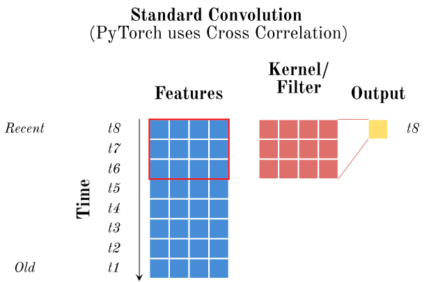
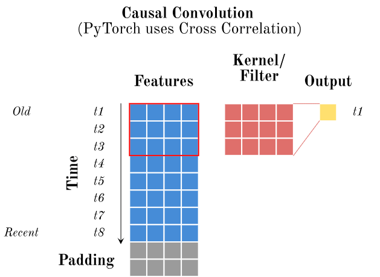

# CausalConv
Implementation of a Causal Convolutional Network (also called TCN). This implementation base on the the idea from [An Empirical Evaluation of Generic Convolutional and Recurrent Networks for Sequence Modeling](https://arxiv.org/abs/1803.01271).

## Usage

## Idea of the CausalConv

In general, a causal (or temporal) convolution convolves time sensitive input such that a specific output only depends on samples from the past and not from the future. One can achieve this behavior "quite easy" with adapting the padding. Another way to do this is to crate a masking tensor before applying a "traditional" convolution. This implementation uses the way of adapting the padding.

Figure 1: Here one can see a standrd 1D convolutional operation, where the data is sorted from the oldest (top) to the most recent (bottom) one. **Problem - The output at a specific time depends on the future!**. This is not desired!

Figure 2: In this example we have again a "standard" 1D convolution. However, here the data is sorted from the most recent (top) to the oldest (bottom). The new order solves the problem, that an output only depends on the past. **Another Problem - We only get outputs for t2 up to t8**. Actually, we want to have a prediction for each time stamp. 

### Solution: Causal Conv (with padding)

To get for each time stamp a prediction (=output) and make sure that a prediction only depends on the past we can use paddings as shown below.

Figure 3: Causal convolution.

**Important**: When you implement this you would append the padding on both sides and remove it afterwards in the output. Which padding ("top or bottom") you delete afterwards depends on the order of you data!
* In case your data is ordered from "old to recent" (as in the gif above) --> Remove the padding at the top
* In case your data is ordered form "recent to old" --> Remove the padding at the bottom

